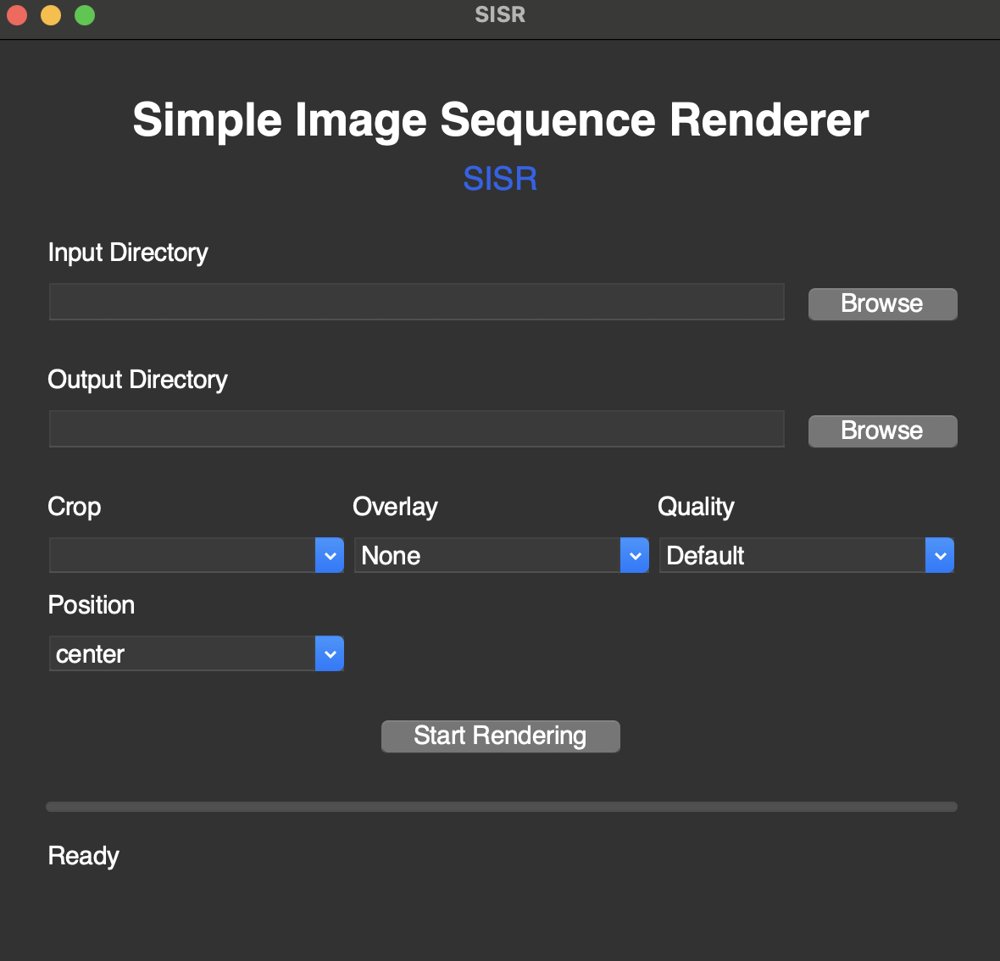

# Simple Image Sequence Renderer (SISR)

A simple tool for converting image sequences into high-quality videos with customizable overlays, cropping options, and GIF support. Perfect for photographers, content creators, and anyone needing to create time lapse videos from image sequences.



**Version:** 0.2.0

## Why This Script?

We created this tool to solve several common challenges in image sequence video creation:
- **Professional Outputs**: We couldn't remember the right FFMPEG commands to do anything, including create valid ProRes. This script has pre-configured options for popular formats and platforms (Instagram, HD, UHD)
- **EXIF Date Preservation**: Many times, we need to overlay the date the image was taken onto the image to show progress over time. This is tough to, but can be done with FFMPEG and an EXIF library alone to automatically extract dates from image metadata and make it into an overlay in the output render
- **User-Friendly**: Let's be honest -- the command line isn't for everyone. So this script includes both command-line and a basic GUI interface so that you don't have to remember too many options.

## Features

### Core Functionality
- Convert image sequences to video or GIF
- Extract and overlay dates from EXIF metadata
- Add frame number overlays
- Progress tracking with visual feedback
- Cross-platform support (macOS, Windows, Linux)

### Output Options
- **Video Formats**: MP4, MOV
- **GIF Support**: High-quality animated GIFs with optimized color palettes
- **Frame Rates**: Customizable (default: 30fps for video, 4fps for GIF)
- **Quality Settings**: Configurable for both video and GIF output

### Cropping Options
- **Instagram**: Vertical format (1080x1920)
- **HD**: 1920x1080 with options to:
  - Keep top portion
  - Keep bottom portion
  - Center crop
- **UHD (4K)**: 3840x2160 with options to:
  - Keep top portion
  - Keep bottom portion
  - Center crop

### Overlay Features
- **Date Overlay**: 
  - Extracts from embedded EXIF metadata
  - Falls back to file modification time
- **Frame Number**: 
  - Sequential frame numbering

## Installation

1. **Clone the repository:**
   ```bash
   git clone https://github.com/timelapsetech/sisr.git
   cd sisr
   ```

2. **Install dependencies:**
   ```bash
   pip install -r requirements.txt
   ```

3. **Install ffmpeg:**
   - macOS: `brew install ffmpeg`
   - Ubuntu/Debian: `sudo apt-get install ffmpeg`
   - Windows: Download from [ffmpeg.org](https://ffmpeg.org/download.html)

### macOS
1. Download the latest **SISR-macOS.zip** from the [Releases page](https://github.com/timelapsetech/sisr/releases)
2. Unzip the file
3. Move `SISR.app` to your Applications folder
4. Launch SISR from your Applications folder

## Usage

### Command-Line Interface

```bash
python -m sisr --input <input_dir> --output-dir <output_dir> [options]
```

**Required Arguments:**
- `--input`: Input directory containing images
- `--output-dir`: Output directory for rendered video

**Optional Arguments:**
- `--fps <number>`: Frames per second (default: 30)
- `--resolution <WxH>`: Custom resolution (e.g., 1920x1080)
- `--instagram-crop`: Crop to Instagram story format (1080x1920)
- `--hd-crop <center|keep-top|keep-bottom>`: Crop to HD format (1920x1080)
- `--uhd-crop <center|keep-top|keep-bottom>`: Crop to UHD format (3840x2160)
- `--overlay-date`: Add date overlay to each frame
- `--overlay-frame`: Add frame number overlay to each frame
- `--quality <default|prores|proreshq|gif>`: Output quality setting (default: default)

**Examples:**
```bash
# Create HD video with date overlay
python -m sisr --input ./images --output-dir ./output --hd-crop center --overlay-date

# Create UHD ProRes video with frame overlay
python -m sisr --input ./images --output-dir ./output --uhd-crop center --overlay-frame --quality prores

# Create Instagram-optimized GIF
python -m sisr --input ./images --output-dir ./output --instagram-crop --quality gif --overlay-frame
```

### GUI Application

Run the GUI for a user-friendly experience:

```bash
python -m sisr
```

**Features:**
- Modern dark theme interface
- Directory selection for input and output
- Output format selection (Video/GIF)
- Crop options (Instagram, HD, UHD)
- Overlay customization (Date, Frame)
- Progress tracking

### Development

#### Running Tests
```bash
# Run all tests
pytest tests/

# Run with coverage report
pytest --cov=sisr tests/
```

#### Code Quality
```bash
# Format code
make format

# Run linters
make lint

# Clean temporary files
make clean
```

## Contributing

We welcome contributions! Please see [CONTRIBUTING.md](CONTRIBUTING.md) for guidelines.

## License

This project is licensed under the MIT License - see the [LICENSE](LICENSE) file for details.

## Acknowledgments

- [ffmpeg](https://ffmpeg.org/) for video processing
- [Pillow](https://python-pillow.org/) for image handling
- [tkinter](https://docs.python.org/3/library/tkinter.html) for the GUI 